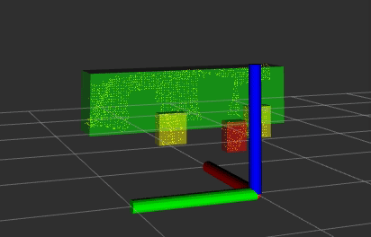

# pcl_extract_cluster_ros  
~~~
rosrun pcl_extract_cluster_ros pcl_extract_cluster_ros_node _target_frame:=camera_link _topic_name:="pc2 topic name"
~~~  

## Demo  

  
  
red objects : the closest object in yellow objects  
yellow objects: objects under cluster_size(default=0.5) meter  
green objects   : the others  
 

